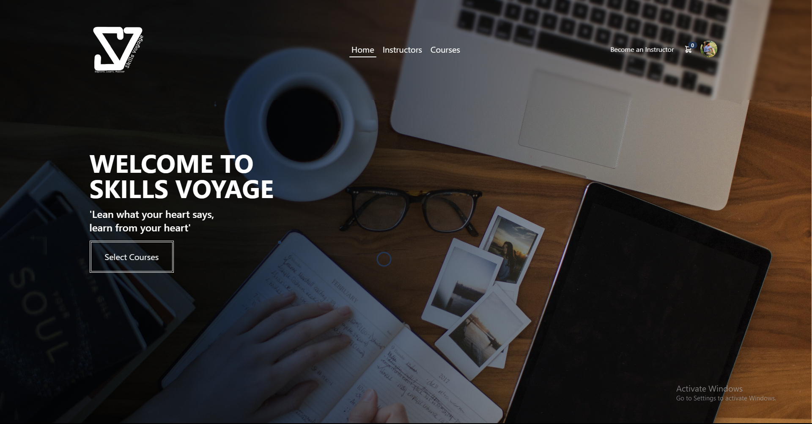

<!--

Skills Voyage |
Explore, Learn, Master |

This is an Skills Development course selling website made with MERN Stack.

### Tech stack used in this project includes:
- ReactJS for the frontend (UI) development using JavaScript and JSX syntax.
- Node.js as a runtime environment for executing JavaScript code server-side.
- Express.js as a web application framework for handling HTTP requests and responses.
- MongoDB as a NoSQL database to store data.
- Tailwind CSS and SASS for design.
- Stripe for payment processing.

### The main features of this site are:
- User registration and login system.
- Admin Dashboard where admin can manage data of this website
- Instructor route for instructors.
- Course listing page showing all available courses.
- Single course page displaying detailed information about each course.
- Payment gateway integrated into the platform so users can purchase any course they want.
- A search bar that allows users to find specific courses by name or category.
- An "Select Course" button which adds the selected product to the user's shopping cart. There is also a "View Cart" feature that shows all items added to the cart

## Project Demo

Click [here](#) to view the Skills Voyage project.

For Backend, click [here](#).

---

## Credentials

### Admin Login:

- **Email:** pujondasauvi@gmail.com
- **Password:** password123456789

### Instructor Login:

- **Email:** auvidas@gmail.com
- **Password:** password123456789

---

  <a href="#project-demo">Explore the Skills Voyage Platform</a>

-->

  Skills Voyage |
  Explore, Learn, Master

---

## About

Skills Voyage is a Skills Development course selling website built with the MERN Stack (MongoDB, Express.js, ReactJS, Node.js). Explore a variety of courses, learn new skills, and master your chosen subjects.

### Tech Stack

- **Frontend (UI) Development:**
  - ReactJS with JavaScript and JSX syntax.
  - Tailwind CSS and SASS for design.

- **Backend Development:**
  - Node.js as a runtime environment.
  - Express.js as a web application framework.

- **Database:**
  - MongoDB, a NoSQL database for efficient data storage.

- **Payment Processing:**
  - Stripe for secure and seamless payment transactions.

---

## Features

- **User Authentication:**
  - User registration and login system.

- **Admin Dashboard:**
  - Admin can efficiently manage website data.

- **Instructor Route:**
  - Dedicated route for instructors.

- **Course Listings:**
  - View all available courses with detailed information.

- **Single Course Page:**
  - Explore in-depth details about each course.

- **Payment Gateway:**
  - Seamless integration of Stripe for secure payment processing.

- **Search Functionality:**
  - Users can find specific courses by name or category.

- **Shopping Cart:**
  - "Select Course" button to add products to the shopping cart.
  - "View Cart" feature displays all items in the cart.

---

## Project Demo

Click [here](https://skills-voyage-elm.netlify.app/) to view the Skills Voyage project.

For Backend, click [here](#https://github.com/the-pujon/skill-voyage-backend).

---

## Credentials

### Admin Login:

- **Email:** pujondasauvi@gmail.com
- **Password:** password123456789

### Instructor Login:

- **Email:** auvidas@gmail.com
- **Password:** password123456789

---

  <a href="https://skills-voyage-elm.netlify.app/">Explore the Skills Voyage Platform</a>

